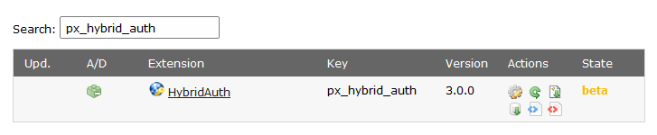

.. ==================================================
.. FOR YOUR INFORMATION
.. --------------------------------------------------
.. -*- coding: utf-8 -*- with BOM.

.. include:: ../Includes.txt

.. _administration:

Administration
==============

Import
------

Import the extension to your server from the

- TYPO3 Extension Repository (TER) or
- via GIT

From TER
^^^^^^^^

Select "*Get Extensions*" in the extension manager and search for "px_hybrid_auth" and click "Import and Install".
There are no dependencies other than TYPO3 6.2

From GIT
^^^^^^^^

.. warning:: add git clone command here

Install
-------
Install the extension and follow the instructions (adding tables, etc...).
After the installation is finished open the Extension Configuration by clicking on the "Configure" gear.

Configure
---------
Please configure the extension after you have successfully installed it.

- :ref:`configuration-extension-manager`
- :ref:`configuration-typoscript`