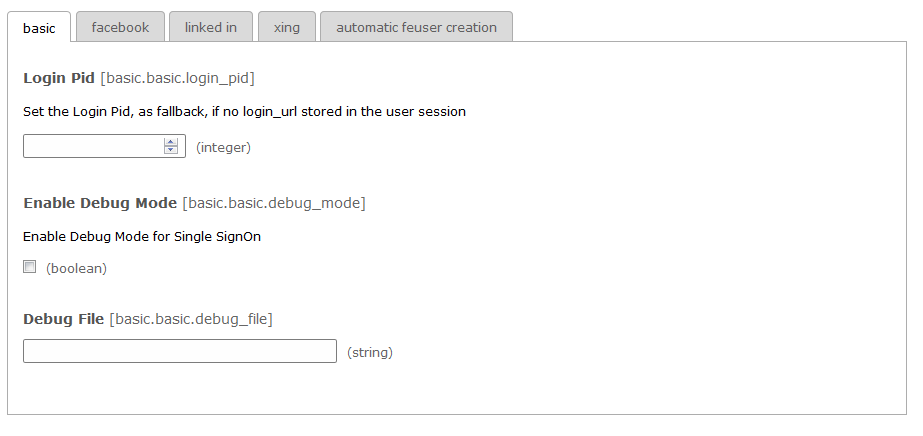
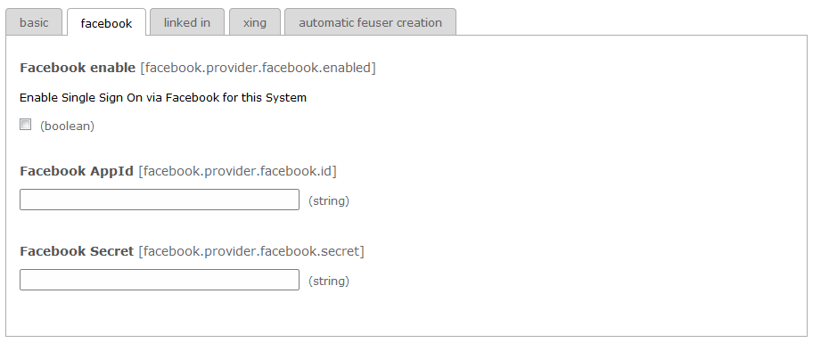
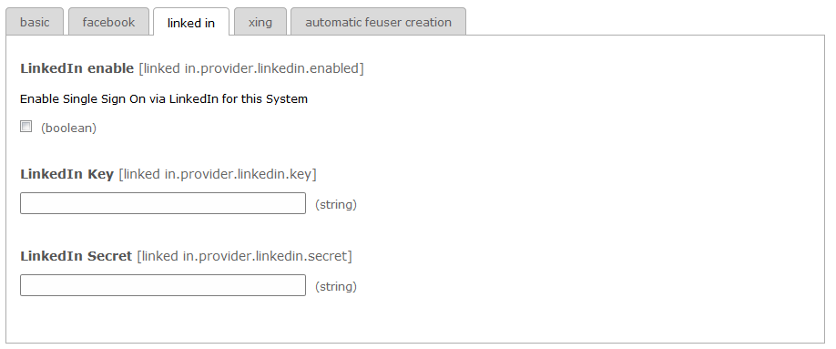
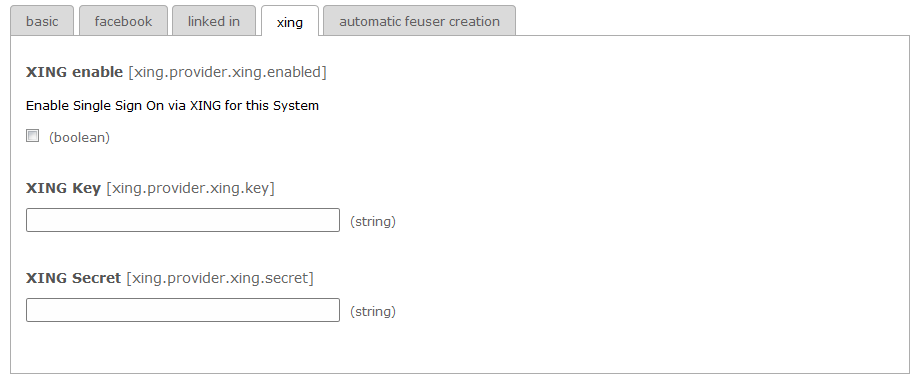
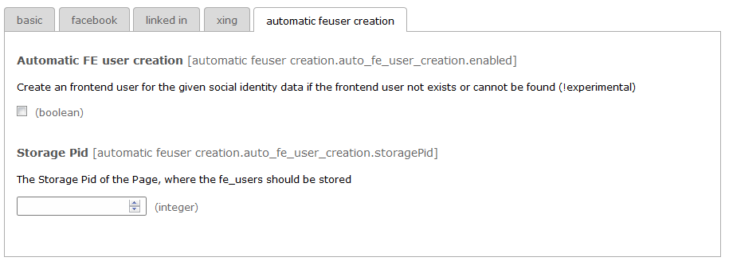

.. ==================================================
.. FOR YOUR INFORMATION
.. --------------------------------------------------
.. -*- coding: utf-8 -*- with BOM.

.. include:: ../../Includes.txt

.. _extension-manager-configuration:

Extension Manager Configuration
^^^^^^^^^^^^^^^^^^^^^^^^^^^^^^^

After you have installed the extension successfully (:ref:`for-administrators`) you need to configure *PxHybridAuth*.

In the different tabs you can configure system wide settings and the social providers (AppId, Secret)

.. note::

    You need to create your own application for the desired social provider on their developer pages.

    Currently the following social providers are supported out-of-the-box:

    - Facebook - https://developers.facebook.com/
    - LinkedIn - https://developer.linkedin.com/
    - Xing - https://dev.xing.com/

Basic
'''''

.. important:: Set the Pid of your Login page. This page will be used as return_url for HybridAuth after oauth process takes place.

If you enable the debug mode for Single SignOn (SSO) you can get additional information if the login to a social provider through PxHybridAuth does not work. You can also define the location of a file where this debug information are stored.

Facebook
''''''''

In this tab you have the following options:
- Enable login through Facebook
- Define the Facebook AppId
- Define the App Secret which is used to generate access tokens

LinkedIn
''''''''

In this tab you have the following options:

- Enable login through LinkedIn
- Define the LinkedIn Key
- Define the LinkedIn Secret

Xing
''''

In this tab you have the following options:

- Enable login through Xing
- Define the Xing Key
- Define the Xing Secret

Automatic feuser creation
'''''''''''''''''''''''''

If you enable this feature a frontend user will be automatically created if no fe_user can be found for the given social identity. Be aware that this feature is still **experimental**.

Please define also a page id where the created users should be stored.