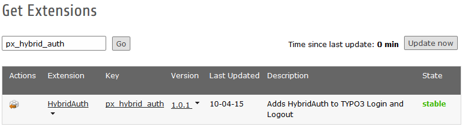

.. ==================================================
.. FOR YOUR INFORMATION
.. --------------------------------------------------
.. -*- coding: utf-8 -*- with BOM.

.. include:: ../Includes.txt

.. _for-administrators:

For Administrators
===================

Import
------

Import the extension to your server from the

- TYPO3 Extension Repository (TER) or
- via GIT

From TER
^^^^^^^^

Select "*Get Extensions*" in the extension manager and update your extension list. Search for "px_hybrid_auth" and click "Import and Install" to get the latest version.
There are no other dependencies than TYPO3 6.2.

From GIT
^^^^^^^^

Please use the following command to get the extension from GIT.

.. code-block:: bash

    git clone https://github.com/portrino/px_hybrid_auth

Install
-------
Install the extension and follow the instructions (adding tables, etc...).
After the installation is finished open the Extension Configuration by clicking on the "Configure" gear.

Configure
---------
Please configure the extension after you have successfully installed it.

.. toctree::
   :maxdepth: 5
   :titlesonly:
   :glob:

   ExtensionManager/Index
   TypoScript/Index