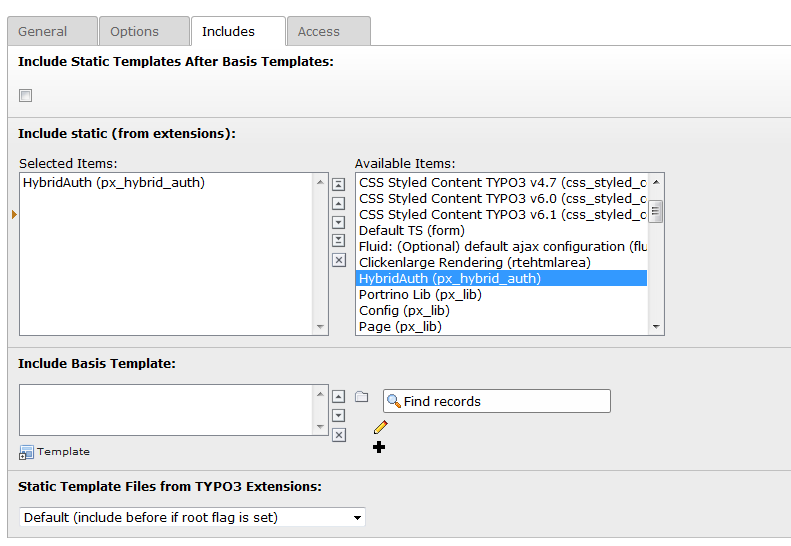

.. ==================================================
.. FOR YOUR INFORMATION
.. --------------------------------------------------
.. -*- coding: utf-8 -*- with BOM.

.. include:: ../../Includes.txt

.. _typoscript-configuration:

TypoScript Configuration
^^^^^^^^^^^^^^^^^^^^^^^^

Include HybridAuth in Template
''''''''''''''''''''''''''''''

Please include the static template of *HybridAuth* either through an Include or through the General options.

| To include the HybridAuth directly in your template setup please use the following code:
| ``<INCLUDE_TYPOSCRIPT: source="FILE:EXT:px_hybrid_auth/Configuration/TypoScript/setup.txt">``
| ``<INCLUDE_TYPOSCRIPT: source="FILE:EXT:px_hybrid_auth/Configuration/TypoScript/constants.txt">``

TypoScript values
'''''''''''''''''

The following values can be defined through TypoScript. This options can be overriden with the flexform values of the plugin.

======================================  ==========  ===============================================================================================================================  ====================================================
TypoScript value                        Data type   Description                                                                                                                      Default
======================================  ==========  ===============================================================================================================================  ====================================================
persistence.storagePid                  string      Define the Storage Folder with the Website User Records, use comma seperated list or single value
persistence.recursive                   integer     The level of recursion
settings.redirectPageLoginError         PID         The page to be redirected to if an error occurs during login
settings.showLogoutFormAfterLogin       boolean     Display logout button after successful login                                                                                     false
settings.loginPid                       PID         The id of the login page.
view.templateRootPaths                  array       Used to define several paths for templates, which will be tried in reversed order (the paths are searched from bottom to top).   10 = EXT:px_hybrid_auth/Resources/Private/Templates/
view.partialRootPaths                   array       Used to define several paths for partials, which will be tried in reversed order (the paths are searched from bottom to top).    10 = EXT:px_hybrid_auth/Resources/Private/Partials/
view.layoutRootPaths                    array       Used to define several paths for layouts, which will be tried in reversed order (the paths are searched from bottom to top).     10 = EXT:px_hybrid_auth/Resources/Private/Layouts/
======================================  ==========  ===============================================================================================================================  ====================================================

Examples
''''''''

Override default buttons with bootstrap markup
~~~~~~~~~~~~~~~~~~~~~~~~~~~~~~~~~~~~~~~~~~~~~~

Display "Sign In with ..." buttons as bootstrap social buttons like here: http://lipis.github.io/bootstrap-social/

Steps:

- add key to partialRootPaths array to override single partial file
- get bootstrap-social css from cdn
- add new partial for button (e.g. facebook button)

::

    plugin.tx_pxhybridauth {
        view {
            partialRootPaths {
                20 = EXT:foo_bar/Resources/Private/Partials/
            }
        }
    }

    page.includeCSS {
        bootstrap-social = //cdnjs.cloudflare.com/ajax/libs/bootstrap-social/4.2.1/bootstrap-social.min.css
        bootstrap-social {
            disableCompression = 1
            excludeFromConcatenation = 1
            external = 1
            forceOnTop = 1
        }
    }

foo_bar/Resources/Private/Partials/FacebookUser/Button.html

::

    <a href="#" class="btn btn-block btn-social btn-facebook" onclick="document.getElementById('new-login-facebook').submit(); return false;">
        <i class="fa fa-facebook"></i> {f:translate(key:'sign_in_facebook')}
    </a>

.. important::

    Because bootstrap-social does not provide styles for input submit, we just can render a link.
    To get the social sign in work though, we need to trigger a form submit during onclick, because we have to send all the information from hidden inputs to TYPO3 AuthenticationService.