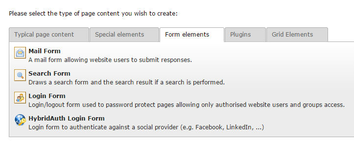
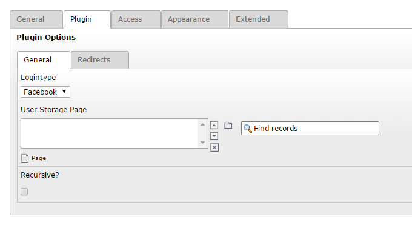
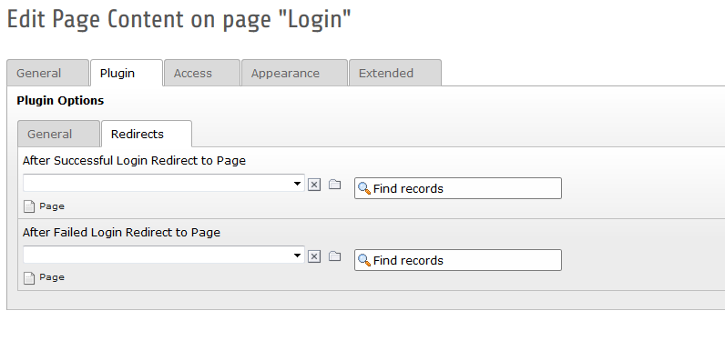
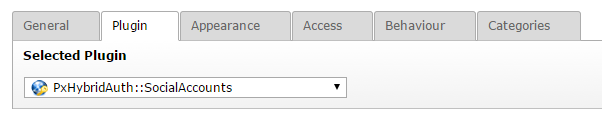
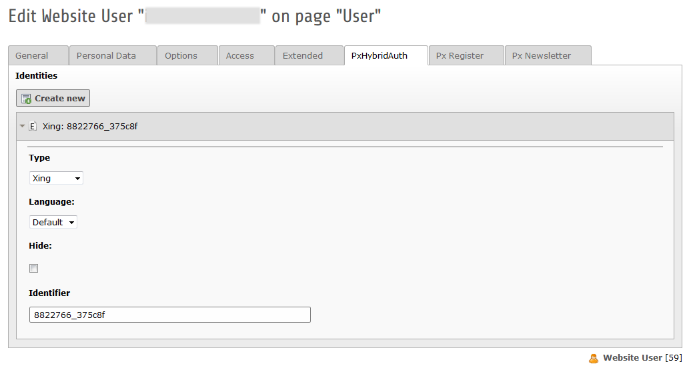

.. ==================================================
.. FOR YOUR INFORMATION
.. --------------------------------------------------
.. -*- coding: utf-8 -*- with BOM.

.. include:: ../Includes.txt

.. _for-users:

For Users
=========

.. _login-form:

Login form
----------

To use this plugin, just create a new content element of the type *HybridAuth Login Form* on your login page. Afterwards you can choose several plugin options within the tabs "General" and "Redirects".

    The HybridAuth login form can be found below the tab "Form elements"

Tab "General"
^^^^^^^^^^^^^

You can choose which social network should be used in the upper DropDown Menu. The content of this list is explained in the topic :ref:`extension-manager-configuration`

    The configuration of the plugin as flexform

Tab "Redirects"
^^^^^^^^^^^^^^^

In the second tab "Redirects" you can choose where to redirect after a successful or failed login.

    Flexform-Redirect

.. _list-of-social-accounts:

List of social accounts
-----------------------

To show the list of providers with which the user is connected in frontend you can put a special plugin to your page. Select the plugin *PxHybridAuth::Social Accounts* and click the save button.

    The plugin for creating a listing of the social accounts

Social accounts of user
-----------------------

After the installation of the *PxHybridAuth* extension you will find a new tab in the fe_user settings. Within this tab the social identities are shown to which the user is connected.

